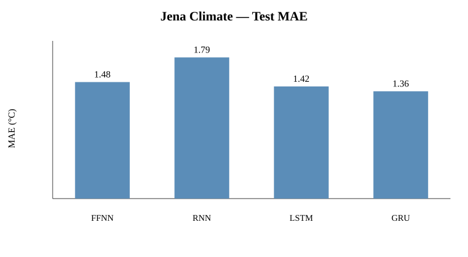
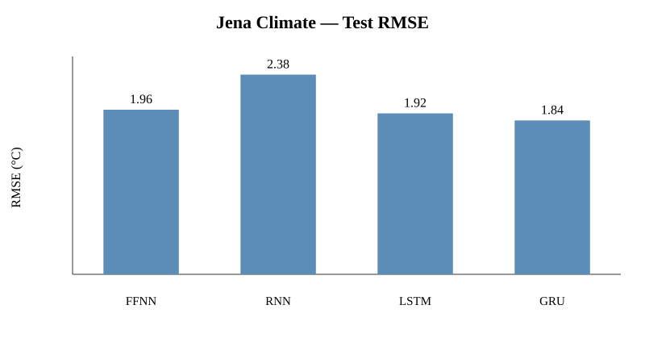
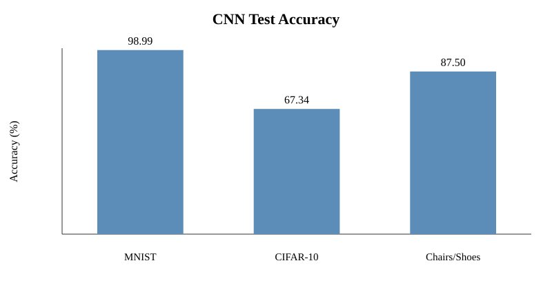

[](https://github.com/israel-alabi1/deep-learning-model-comparison/actions/workflows/python-package.yml)
# Deep Learning Model Comparison

A reproducible portfolio study comparing neural-network architectures for **multivariate time-series forecasting** and **image classification**. The project revisits a deep-learning assignment with controlled experiments, reusable Python modules, explicit evaluation, and documented limitations.

## What is compared?

| Task | Models / datasets | Main metric |
|---|---|---|
| Temperature forecasting | FFNN, Vanilla RNN, LSTM, GRU on Jena Climate | MAE / RMSE (°C) |
| Image classification | CNN on MNIST, CIFAR-10, Chairs vs Shoes | Test accuracy |

## Results at a glance

### Jena Climate — 4-hour-ahead forecasting

Each model receives **72 observations (12 hours)** of multivariate weather data and predicts temperature **24 observations (4 hours)** ahead. Metrics are reported after inverse-transforming the standardized target to °C.

| Model | Test MAE (°C) | Test RMSE (°C) |
|---|---:|---:|
| FFNN | 1.478 | 1.964 |
| Vanilla RNN | 1.790 | 2.383 |
| LSTM | 1.422 | 1.921 |
| GRU | **1.361** | **1.836** |

### CNN image classification

| Dataset | Test accuracy | Evaluation size |
|---|---:|---:|
| MNIST | **98.99%** | 10,000 |
| CIFAR-10 | **67.34%** | 10,000 |
| Chairs vs Shoes | **87.50% (7/8)** | 8 |

> The local Chairs vs Shoes result is descriptive only: the test set contains just 8 images.

## Visual results

### Sequence models





### CNNs



## Methodology

### Time series
- Chronological train/validation/test split: 70% / 20% / 10%
- Input width: 72 observations
- Forecast horizon: 24 observations
- Standardization fitted on training data only
- Adam optimizer, learning rate 0.001
- Batch size 256; 20 epochs
- Fixed seed: 42

Architectures:
```text
FFNN        Flatten → Dense(128) → Dense(64) → Dense(1)
Vanilla RNN SimpleRNN(32) → Dense(1)
LSTM        LSTM(32) → Dense(1)
GRU         GRU(32) → Dense(1)
```

### CNNs

MNIST and CIFAR-10 use the same baseline architecture for a controlled comparison:
```text
Conv2D(32) → MaxPooling → Conv2D(64) → MaxPooling
→ Flatten → Dense(128) → Softmax
```

Training uses Adam, sparse categorical cross-entropy, batch size 128, 10 epochs, and seed 42. The local Chairs vs Shoes experiment uses a deeper three-block CNN with augmentation.

## Reproducibility

The original assignment did not control random seeds. This portfolio version fixes Python, NumPy, and TensorFlow seeds and enables deterministic TensorFlow operations where supported. Model definitions, sequence construction, and core evaluation utilities are kept in `src/` and imported by the notebooks.

The reproducibility rerun confirmed the qualitative ordering of the recurrent forecasting models. The FFNN showed greater run-to-run sensitivity, while CIFAR-10 also exhibited some variation.

## Limitations

- Architectures and hyperparameters are fixed rather than systematically tuned.
- Forecasting windows are constructed separately within each chronological split.
- The local image dataset contains only 36 training and 8 test images.
- Results are task-specific and should not be interpreted as evidence that one architecture is universally superior.

## Repository structure

```text
deep-learning-model-comparison/
├── README.md
├── requirements.txt
├── .gitignore
├── data/
│   └── README.md
├── notebooks/
│   ├── 01_jena_time_series_forecasting.ipynb
│   └── 02_cnn_image_classification.ipynb
├── src/
│   ├── __init__.py
│   ├── preprocessing.py
│   ├── models.py
│   └── evaluation.py
└── results/
    ├── figures/
    └── tables/
```

## Running the project

```bash
python -m venv .venv
source .venv/bin/activate
pip install -r requirements.txt
jupyter notebook
```

Run the notebooks from the repository root or adjust the documented data paths. MNIST and CIFAR-10 are downloaded by Keras. Raw Jena and local image data are intentionally excluded from version control; see `data/README.md`.

## Portfolio description

**Deep Learning Model Comparison —** Built a reproducible benchmark of FFNN, RNN, LSTM, GRU, and CNN architectures across time-series forecasting and image classification tasks, with reusable TensorFlow modules, controlled experiments, and comparative evaluation.

## License / data note

This repository contains code, notebooks, summary results, and visualizations. Source datasets are not redistributed where their licensing or size makes that inappropriate.
